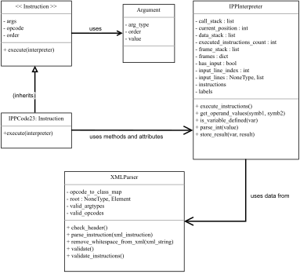

Implementační dokumentace k 2. úloze do IPP 2022/2023
Jméno a příjmení: Roman Poliačik
Login: xpolia05

# IPPcode23 Interpreter

IPPcode23 interpreter is designed for executing IPPcode23 programs written in XML format. The interpreter follows an object-oriented approach, using multiple classes such as Instruction, Argument, XMLParser, and IPPInterpreter.

## Classes
### Instruction (Abstract Class)
The Instruction class represents an individual instruction in the IPPcode23 program and serves as an abstract base class. Each instruction has it's own order, opcode, and a list of arguments (which are objects of the Argument class). The Instruction class has an abstract method execute() that must be implemented by subclasses representing specific instruction types.

### Instruction Subclasses (e.g., Move, Defvar ...)
Various instruction types are implemented as subclasses of the Instruction abstract class. These subclasses use methods and attributes provided by the IPPInterpreter class to perform the specific functionality of each instruction. Since there are 32 different instructions in total, each one is implemented as a separate subclass, inheriting from the Instruction class (except for functions ADD/SUB/MUL/IDIV, AND/OR/NOT, LT/EQ/GT and JUMPIFEQ/JUMPIFNEQ, which are merged together into one instruction class). 

### Argument
The Argument class stores an argument's data type, value, and order in the instruction. It provides a simple way to represent an argument and is used by instances of the Instruction class.

### XMLParser
The XMLParser class is responsible for parsing and validating an IPPcode23 program in XML format. It consists of several methods, properties, and a constructor.

#### Constructor (\_\_init\_\_)
The constructor takes an XML string as an input and attempts to parse it using the xml.etree.ElementTree library. The parsed XML tree's root is then stored in the root attribute. If there is a parsing error, root is set to None.

#### Properties
`valid_opcodes` is a property that returns a dictionary containing valid instruction names and their required number of arguments.

`valid_argtypes` is a property that returns a dictionary containing regex patterns for validating argument values based on type.

`opcode_to_class_map` is a property that returns a dictionary mapping opcodes to their subclasses of the Instruction abstract class.

#### Methods
`remove_whitespace_from_xml(xml_string)` is a static method that takes an XML string as input, removes any whitespace between elements, and returns a new XML string without the whitespace which is then used as input to the XMLParser main part.

`check_header()` checks if the parsed XML tree has a valid program header.

`parse_instruction(xml_instruction)` is a method that takes an XML instruction element as input, validates the order and opcode attributes, collects and validates the arguments, and returns a new Instruction subclass instance with initialized attributes.

`validate_instructions()` iterates through the root element's child elements, validates each instruction, checks for duplicate instruction orders and labels, and returns a list of sorted instructions as they are ordered in IPPCode23 program and a dictionary of labels containing their order in program - used for logic in program flow control instructions.

`validate()` is the main method of the class, which checks the program header and validates the instructions. It returns an error code and error message if validation fails, otherwise, it returns 0 and None meaning no errors occured.

### IPPInterpreter
The IPPInterpreter class is the main component of the interpreter, executing the parsed instructions by order. It maintains the program state, including the frames, frame stack, call stack, data stack, labels and the current position in the instruction list. The attribute `self.input_lines` is for handling instruction `Read`, which helps to choose whether to use input from stdin or file.

The IPPInterpreter provides several methods, like `is_variable_defined()`, `get_operand_values()`, and `parse_int()` which are used by the Instruction subclasses to perform their specific operations.

#### Constructor (\_\_init\_\_)
Initializes the IPPInterpreter instance with the instructions, labels, and input lines. It also sets up necessary parts of IPPCode23, such as the frames (Global Frame, Local Frame, and Temporary Frame), frame stack, call stack and data stack.
The other attributes are intended for Interpreter to execute instructions of the program correctly.

#### Methods
`is_variable_defined`: Checks if a given variable is defined in the given frame (Global Frame, Local Frame, or Temporary Frame). Depending on frame that it was provided, if it was Global, function just checks if variable exists within it, since Global Frame does not have to be initialized. For the other two, it first checks if the frames exist, and then if the variable is defined on them. Returns an error code and error message if the variable is not defined.

`get_operand_values`: Retrieves the values and types of the given operands (symb1, symb2). This method is used to process the arguments for various instructions. Uses different logic to get value and type when the instruction's operand is a variable. It returns an error code, error message, and the corresponding values and types for the given operands.

`store_result`: Stores the result of an instruction execution in the specified variable within the appropriate frame. Returns an error if there's an attempt to store a variable in undefined frame.

`parse_int`: Parses a string and checks if it's an integer (hexadecimal, octal, or decimal). Returns the converted integer value if successful, or None if it's not a valid integer.

`execute_instructions`: This method is the main part of the interpreter. A loop that iterates over the ordered instructions list from XMLParser and executes them. It returns an error code, error message, the current position in the instruction list, and the executed instruction's name if any error occured in any instruction.

## UML diagram

## Execution Flow
- Parse command-line arguments.
- Read the XML-formatted source code and input from standard input/file(depends on arguments chosen).
- Use the XMLParser class to remove whitespace from the XML string 
- Validate the IPPcode23 program, creating instances of instructions, return a list of instructions and labels for the interpreter.
- Create an instance of the IPPInterpreter class with the parsed instructions, labels, and input.
- Execute the instructions in the correct order using the IPPInterpreter class, returning errors as needed.